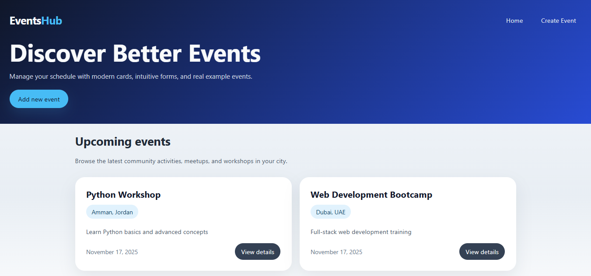
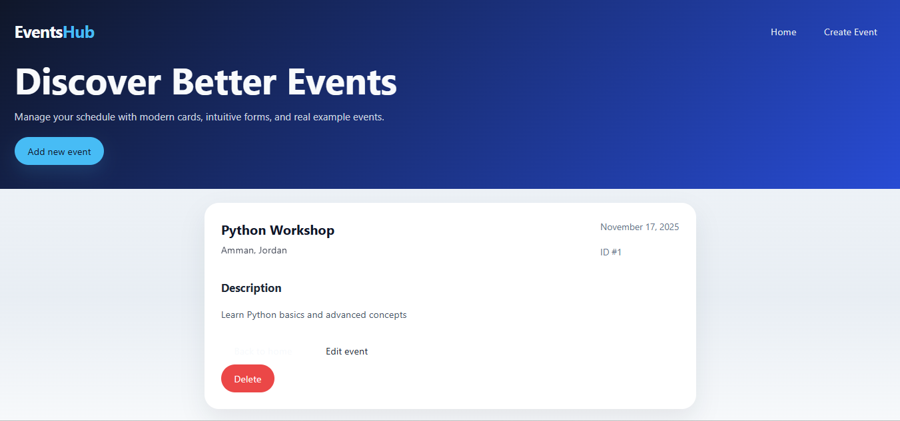
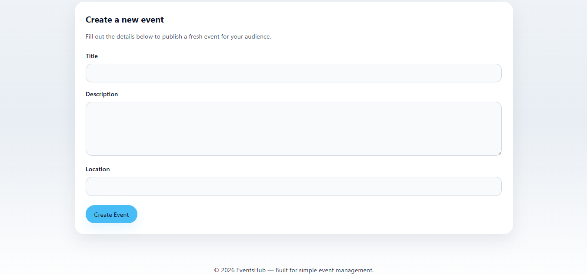

# Events Management Website

Web application for event creation, updates, and management using **Flask** and **SQLite**.

---

## 🚀 Features
- Create, update, and delete events
- User-friendly interface with HTML/CSS templates
- Data stored securely in SQLite database
- Logging system for tracking server activity

---

## 📂 Project Structure
- `app.py` → Main application file
- `Forms.py` → Forms and validation
- `templates/` → HTML templates
- `static/` → CSS, JS, and images
- `instance/` → Local database files
- `.gitignore` → Ignored files (venv, logs, cache)

---

## ⚙️ Installation & Setup
1. Clone the repository:
   ```bash
   git clone https://github.com/LaithYousef-bit/Events_Management.git
   cd Events_Management
2. Create a virtual environment:
   ```bash
   python -m venv venv
   source venv/bin/activate   # Linux/Mac
   venv\Scripts\activate      # Windows
3. Install dependencies:
   ```bash
   pip install -r requirements.txt
4. Run the application:
   ```bash
   python app.py
5. Open in browser:
   ```bash
   http://127.0.0.1:5000/

   
## 📸 Screenshots

### Homepage


### View Details


### Create a New Event



